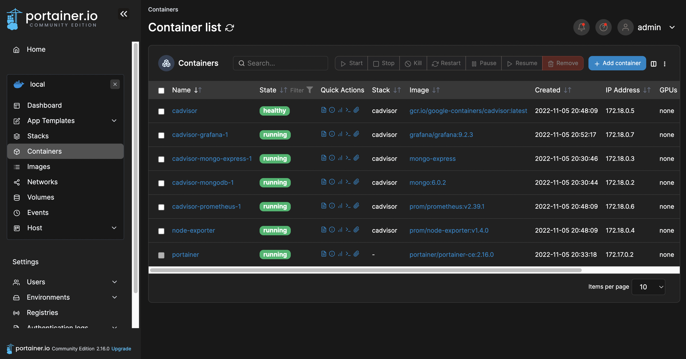

### Launch a virtual machine in local with Vagrant [here](https://github.com/bao-nguyen-khac/devops-setup/tree/main/init-local-vm/vagrant)
### Automation install Docker and K8s with Ansible [here](https://github.com/bao-nguyen-khac/devops-setup/tree/main/init-k8s/ansible)
### Cluster initialization on K8s [here](https://github.com/bao-nguyen-khac/devops-setup/tree/main/init-k8s)
### Install jenkins, prometheus vs grafana, nginx-ingress,.. on K8s with Helm and on Docker [here](https://github.com/bao-nguyen-khac/devops-setup/tree/main/installation)

|                                        Dashboard                                        |
| :--------------------------------------------------------------------------------: | 
|  | 

|                                        Grafana                                        |
| :--------------------------------------------------------------------------------: | 
|  | 

|                                        Jenkins                                        |
| :--------------------------------------------------------------------------------: | 
|  | 

|                                        ArgoCD                                        |
| :--------------------------------------------------------------------------------: | 
|  | 

|                                        Argo Rollouts                                        |
| :--------------------------------------------------------------------------------: | 
|  | 

|                                        Harbor registry                                       |
| :--------------------------------------------------------------------------------: | 
|  | 

|                                        Portainer                                       |
| :--------------------------------------------------------------------------------: | 
|  | 