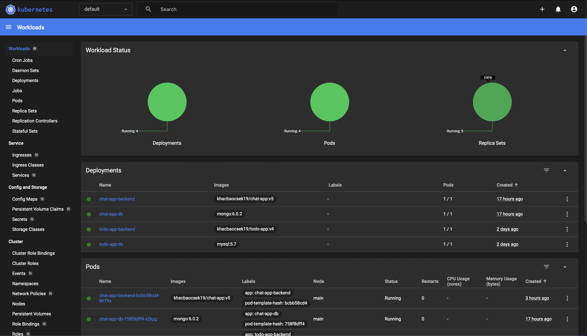
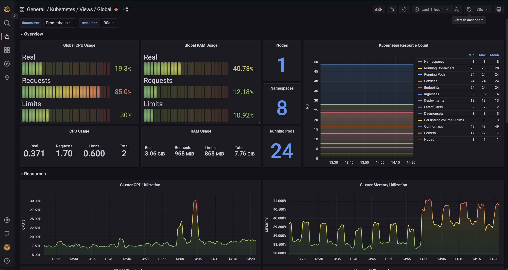
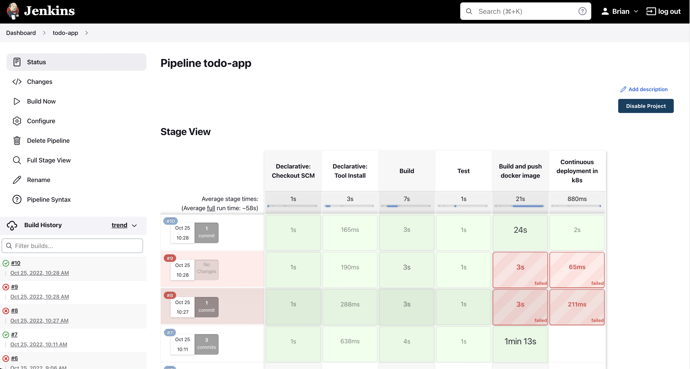
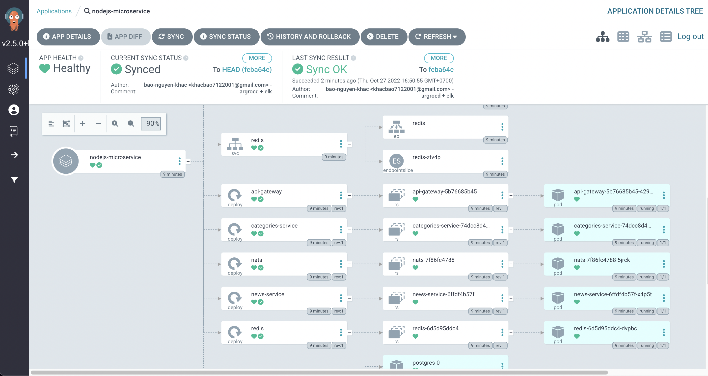
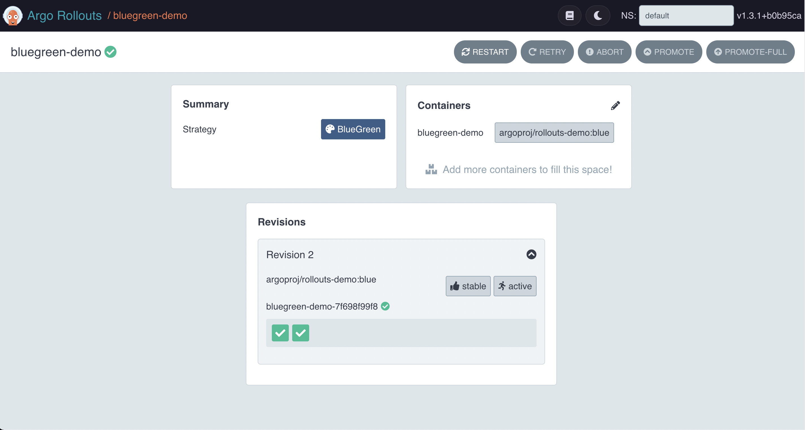
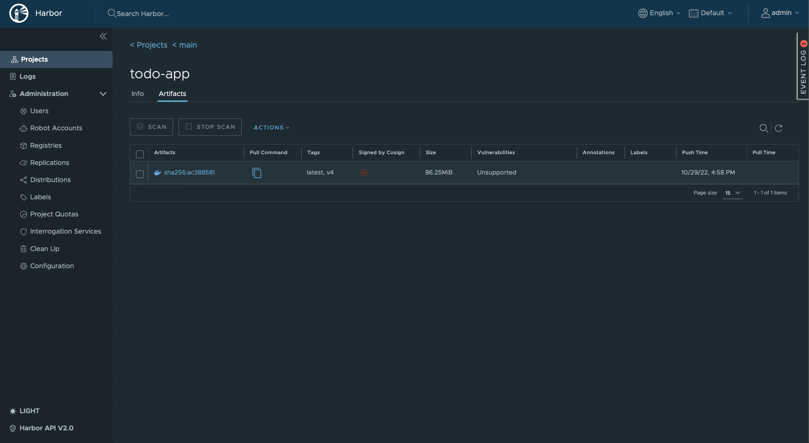

## Initialize virtual machine with Vagrant
## Automation install docker vs k8s with Ansible
## K8s cluster initialization
## Install jenkins, prometheus vs grafana, nginx-ingress in k8s with helm

|                                        Dashboard                                        |
| :--------------------------------------------------------------------------------: | 
|  | 

|                                        Grafana                                        |
| :--------------------------------------------------------------------------------: | 
|  | 

|                                        Jenkins                                        |
| :--------------------------------------------------------------------------------: | 
|  | 

|                                        ArgoCD                                        |
| :--------------------------------------------------------------------------------: | 
|  | 

|                                        Argo Rollouts                                        |
| :--------------------------------------------------------------------------------: | 
|  | 

|                                        Harbor registry                                       |
| :--------------------------------------------------------------------------------: | 
|  | 